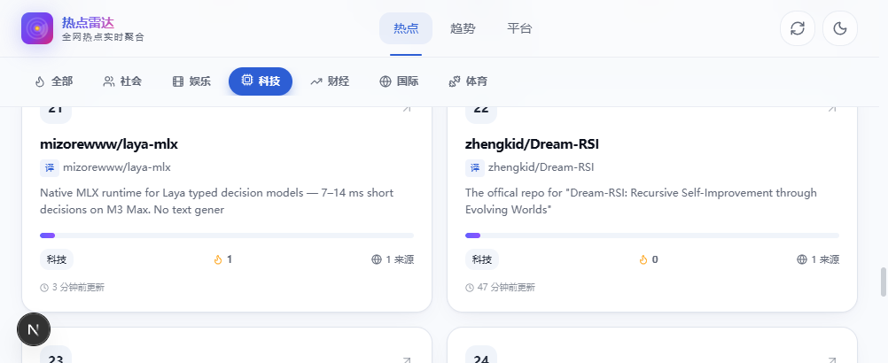
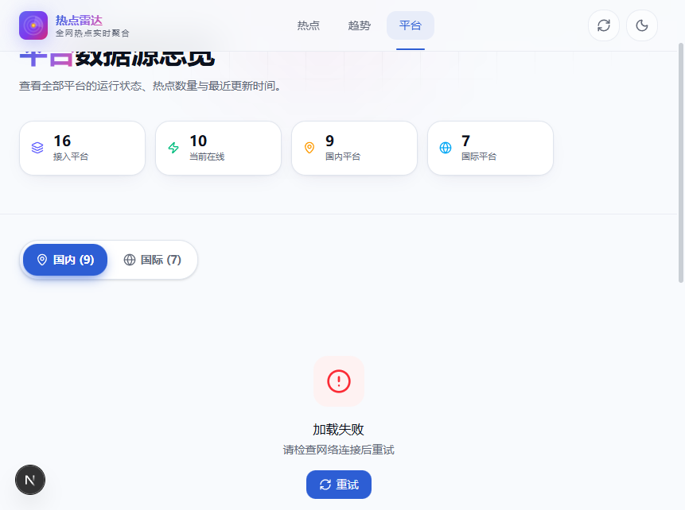
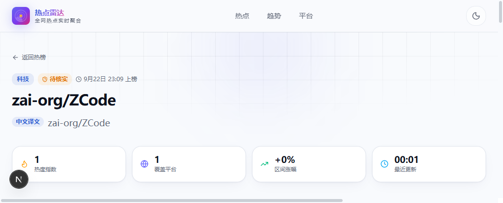

# 🔥 HotRadar · 全网热点一站洞悉

> 聚合 16 个主流平台热搜，跨平台去重、智能分类，AI 秒级生成事件摘要与解读。

[](https://nextjs.org)
[](https://react.dev)
[](https://www.typescriptlang.org)
[](https://nodejs.org)
[](https://expressjs.com)
[](https://www.sqlite.org)
[](https://tailwindcss.com)

<p align="center">
  
</p>

## ✨ 功能特性

- **多平台聚合**：覆盖 16 个国内外主流平台热搜，5 分钟自动全量刷新
- **跨平台去重**：同事件多平台来源合并，热度指数综合排序
- **智能分类**：自动归类到社会 / 娱乐 / 科技 / 财经 / 国际 / 体育
- **AI 解读**：DeepSeek 生成事件概述、核心要点、背景、影响与趋势
- **多语言译文**：非中文标题自动翻译为中文，阅读无障碍
- **热度趋势**：实时采样事件热度变化，可视化趋势曲线
- **平台监控**：每个平台在线状态、响应耗时、采集条数一目了然

## 🖼️ 界面预览

### 热点列表（带译文）

<p align="center">
  
</p>

### 平台运行状态

<p align="center">
  
</p>

### 详情页（AI 解读 + 中文译文）

<p align="center">
  
</p>

## 🌐 支持平台

| 分组 | 平台 | 状态 |
|:---:|:---|:---:|
| 国内 | 微博、百度、哔哩哔哩、抖音、今日头条、豆瓣 | ✅ 在线 |
| 国内 | 知乎、小红书、微信 | ⚠️ 需登录态 / 无公开接口 |
| 国际 | GitHub 热门、红迪热帖、谷歌趋势、黑客新闻 | ✅ 在线（需代理） |
| 国际 | 推特、优兔视频、产品猎手 | ⚠️ 反爬 / 需登录 |

> 国际平台通过 `PROXY_URL` 走本地代理采集；知乎可通过配置 `ZHIHU_COOKIE` 恢复采集。

## 🏗️ 技术栈

| 层 | 技术 |
|:---|:---|
| 前端 | Next.js 16 (App Router) · React 19 · Tailwind CSS v4 · SWR · Recharts |
| 后端 | Express 4 · TypeScript · tsx · better-sqlite3 |
| AI | DeepSeek (OpenAI 兼容接口) · 规则降级兜底 |
| 数据库 | SQLite (WAL 模式) |
| 部署 | 前端 Vercel / 后端 pm2 或 Docker |

## 🚀 快速开始

### 环境要求

- Node.js **>= 20**
- pnpm（推荐）或 npm
- 可选：本地代理（如 Clash Verge）用于采集国际平台

### 1. 克隆并安装

```bash
git clone https://github.com/Pnawei/HotspotRadar.git
cd HotspotRadar

# 前端依赖
pnpm install

# 后端依赖
cd server && pnpm install
```

### 2. 配置后端环境变量

```bash
cd server
cp .env.example .env
```

编辑 `server/.env`，关键项：

| 变量 | 说明 | 默认值 |
|:---|:---|:---|
| `PORT` | 后端端口 | `3001` |
| `DB_PATH` | SQLite 数据库路径 | `./data/hotradar.db` |
| `CRAWL_INTERVAL_MS` | 爬取间隔（毫秒） | `300000` |
| `DEEPSEEK_API_KEY` | DeepSeek 密钥（不填则用规则降级） | 空 |
| `PROXY_URL` | 国际平台代理，`none` 关闭 | `http://127.0.0.1:7897` |
| `ZHIHU_COOKIE` | 知乎 Cookie（可选） | 空 |
| `GITHUB_TOKEN` | GitHub Token（可选，提升限额） | 空 |

### 3. 启动开发服务

```bash
# 后端（终端 1，端口 3001）
cd server && pnpm dev

# 前端（终端 2，端口 3000）
pnpm dev
```

打开 [http://localhost:3000](http://localhost:3000) 即可访问。

> 首次启动后端会自动执行全站爬取，约 10–30 秒后首页出现数据。

## 📁 目录结构

```
HotRadar-main/
├── app/                    # 前端页面（App Router）
│   ├── page.tsx            # 首页热榜
│   ├── detail/[id]/page.tsx# 热点详情
│   ├── platforms/          # 平台状态
│   └── trend/              # 热度趋势
├── components/             # 前端组件
├── lib/                    # 类型与工具
├── public/                 # 静态资源
├── server/                 # 后端服务
│   └── src/
│       ├── crawler/        # 各平台爬虫（16 个）
│       ├── ai/             # DeepSeek 调用、翻译、摘要
│       ├── routes/         # API 路由
│       ├── db/             # SQLite 数据层
│       └── utils/          # 代理、HTTP 工具
└── docs/screenshots/       # README 配图
```

## 🔌 核心 API

| 方法 | 路径 | 说明 |
|:---:|:---|:---|
| GET | `/api/hot?category=&page=&pageSize=` | 热点列表（含中文译文 `titleZh`） |
| GET | `/api/hot/:id` | 热点详情（AI 扩充 + 来源 + 相关报道） |
| GET | `/api/platforms` | 16 个平台运行状态 |
| GET | `/api/trends` | 热度趋势榜 |
| POST | `/api/ai/summarize` | AI 摘要 / 深度分析 |

## 📦 构建与部署

```bash
# 前端构建
pnpm build
pnpm start

# 后端生产运行
cd server && pnpm start
```

## ⚠️ 免责声明

本项目仅聚合公开热榜标题，并由 AI 自动生成简短解读，不转载原文全文；页面所涉内容与标识的版权均归原平台及作者所有。AI 解读可能存在偏差，仅供参考，请以来源平台原文及权威信源为准。

## 📄 License

MIT
